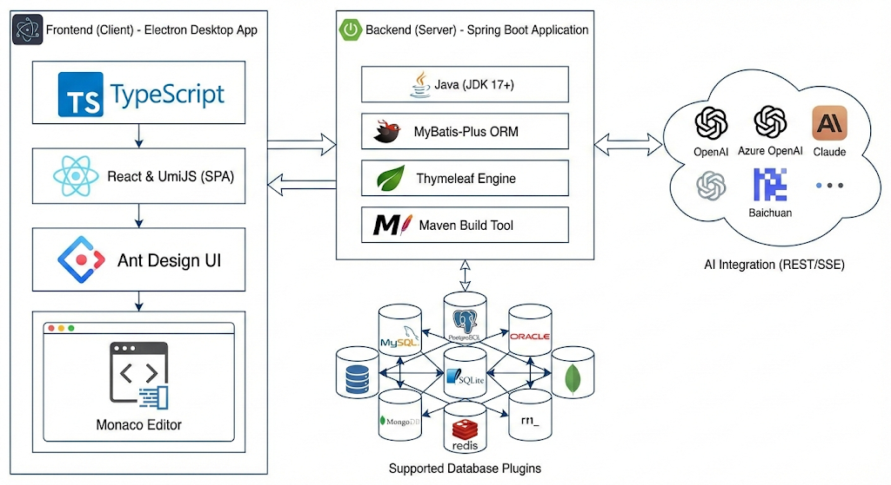
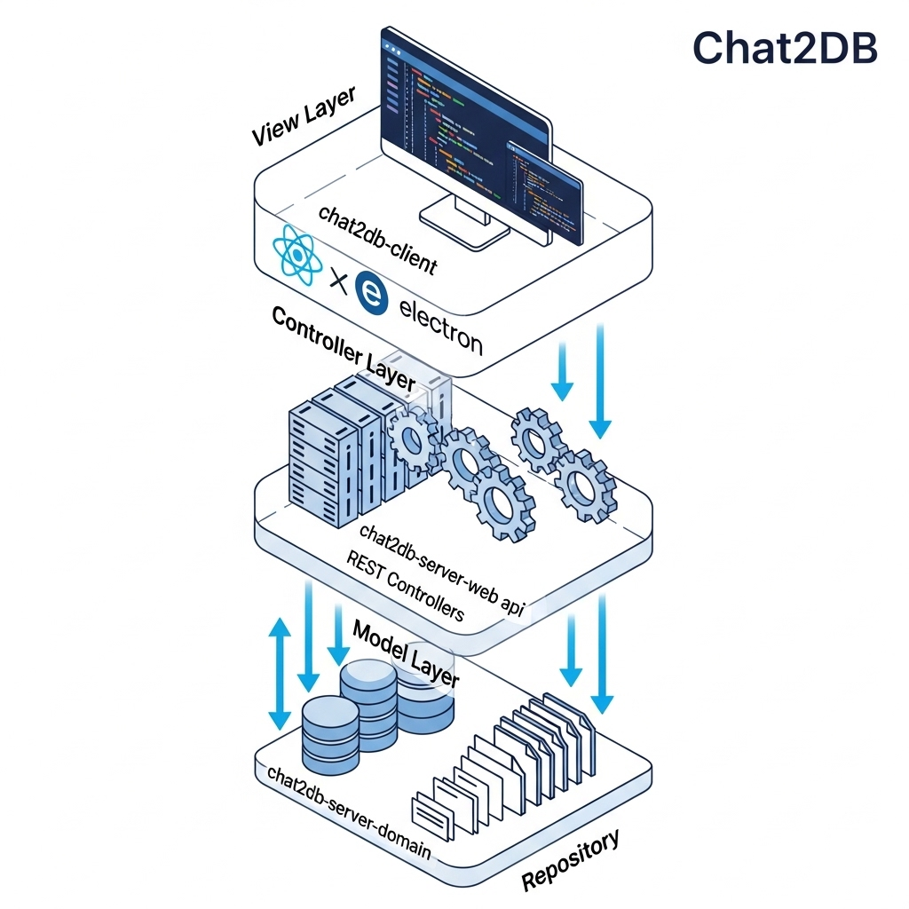
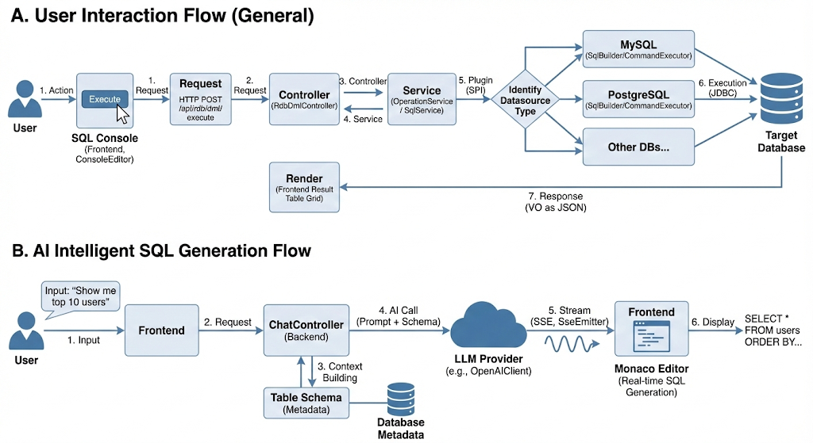
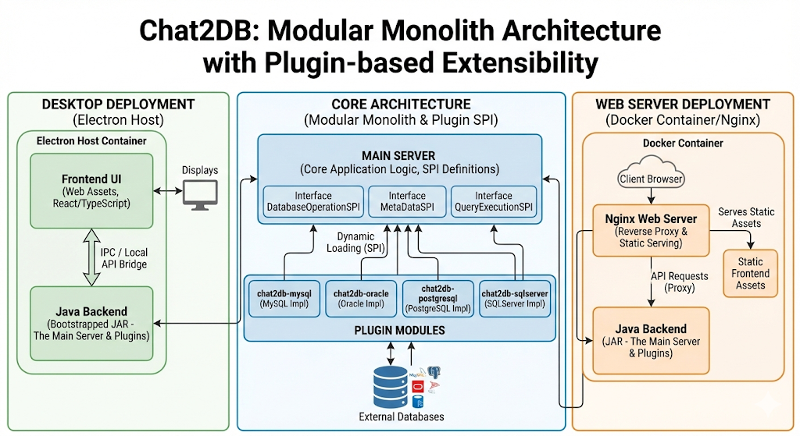

---

# Chat2DB Project Analysis

## 1. Project Overview

**Chat2DB** is a multi-platform, AI-driven database management tool designed to integrate intelligent SQL generation with traditional database operations. It aims to replace traditional SQL clients (like Navicat or DBeaver) by offering a modern, chat-based interface alongside standard visual database management features. It allows users to write SQL using natural language, optimize queries, and generate reports/dashboards automatically.

* **Type:** Database Client & Intelligent Data Analysis Tool
* **Core Philosophy:** "Chat to Database" – interacting with data via natural language.
* **Distribution:** Open Source (Community), Local, and Pro versions.
* **Platforms:** Windows, macOS, Linux, and Web (Docker).

## 2. Tech Stack

### **Frontend (Client)**

The frontend is a modern Single Page Application (SPA) wrapped for desktop usage.

* **Language:** **TypeScript** / JavaScript
* **Framework:** **React** (implied by `.tsx` files and Umi usage)
* **Application Framework:** **UmiJS** (evidenced by `.umirc.ts`)
* **UI Component Library:** **Ant Design** (evidenced by `antd.less` and standard Umi patterns)
* **Code Editor:** **Monaco Editor** (Visual Studio Code's editor core, used for the SQL console and editing)
* **Desktop Wrapper:** **Electron** (allows the web app to access system resources and run as a desktop app)
* **State Management:** Likely **DvaJS** (common with Umi) or React Context/Hooks (`treeStore.ts`).
* **Build Tools:** Webpack (via Umi), Yarn.

### **Backend (Server)**

The backend is a robust Java application built on the Spring ecosystem.

* **Language:** **Java** (JDK 17+ recommended)
* **Framework:** **Spring Boot** (Core application framework)
* **ORM / Data Access:** **MyBatis-Plus** (evidenced by `MyBatisPlusConfig.java` and `Mapper.xml` files)
* **Database Connection:** **JDBC**, **Druid** (Connection pooling)
* **Template Engine:** **Thymeleaf** (Used for serving the initial entry point `template.html`)
* **Build Tool:** **Maven** (`pom.xml`)
* **JSON/Utils:** Fastjson or Jackson, Hutool (implied by `Easy*` naming conventions in tools).

### **Supported Databases (Plugins)**

The system uses a plugin architecture to support various databases, including:

* MySQL, PostgreSQL, Oracle, SQLServer, SQLite, H2, ClickHouse, OceanBase, DB2, MariaDB, DM, Presto, Hive, KingBase, MongoDB, Redis, Snowflake.

### **AI Integration**

* **Services:** OpenAI (ChatGPT), Azure OpenAI, Claude, Baichuan, Tongyi Qianwen, Wenxin Yiyan, Zhipu AI.
* **Mechanism:** RESTful API calls and Server-Sent Events (SSE) for streaming responses.

## 3. MVC Architecture Implementation

The project follows a separation of concerns pattern, with a clear distinction between the Frontend (View) and Backend (Model-Controller).

### **Model (Data Layer)**

Located primarily in `chat2db-server-domain`.

* **Entities (DO):** Maps directly to database tables (e.g., `DataSourceDO`, `TeamDO`, `OperationLogDO`). Found in `chat2db-server-domain-repository`.
* **Data Transfer Objects (DTO/Param):** Used for passing data between layers (e.g., `DataSourceCreateParam`).
* **Repository/Mapper:** Interfaces extending MyBatis logic to perform CRUD operations on the internal database (H2/MySQL).

### **View (Presentation Layer)**

Located in `chat2db-client`.

* **Components:** React functional components (`.tsx`) located in `src/pages` and `src/components` (e.g., `ConsoleEditor`, `Dashboard`, `ConnectionEdit`).
* **Styling:** Less (`.less`) files for component-specific styles.
* **Rendering:** Client-side rendering (CSR) mostly, with Electron providing the native window frame.

### **Controller (API Layer)**

Located in `chat2db-server-web-api`.

* **REST Controllers:** Java classes annotated with `@RestController` that handle HTTP requests from the frontend.
* Examples: `DataSourceController`, `SqlController`, `ChatController`.

* **Routing:** Handled by Spring MVC on the backend and Umi Router on the frontend.

## 4. Control Flow Systems

### **A. User Interaction Flow (General)**

1. **Action:** User clicks "Execute" in the SQL Console.
2. **Request:** Frontend (`ConsoleEditor`) sends an HTTP POST request to `/api/rdb/dml/execute`.
3. **Controller:** `RdbDmlController` receives the request.
4. **Service:** Calls `OperationService` or `SqlService`.
5. **Plugin (SPI):** The system identifies the datasource type (e.g., MySQL) and loads the corresponding implementation of `SqlBuilder` or `CommandExecutor` via the Java SPI mechanism (`ai.chat2db.spi.Plugin`).
6. **Execution:** The query is executed against the target database via JDBC.
7. **Response:** Results are mapped to a VO (Value Object) and returned as JSON.
8. **Render:** Frontend updates the result table grid.

### **B. AI Intelligent SQL Generation Flow**

1. **Input:** User types a natural language prompt (e.g., "Show me top 10 users").
2. **Request:** Frontend sends a request to `ChatController`.
3. **Context Building:** Backend retrieves the current table schema (metadata) to give the AI context.
4. **AI Call:** `OpenAIClient` (or other provider) sends the prompt + schema to the LLM.
5. **Stream:** The AI response is streamed back to the client using **Server-Sent Events (SSE)** (`SseEmitter`).
6. **Display:** The frontend types out the generated SQL in real-time in the Monaco Editor.

## 5. Architecture

Chat2DB employs a **Modular Monolith** architecture with a strong emphasis on **Plugin-based extensibility** and a **Client-Server** model.

* **Plugin SPI (Service Provider Interface):** This is the core architectural highlight. The main server defines interfaces (`ai.chat2db.spi`) for database operations. Specific database support (MySQL, Oracle, etc.) is implemented in separate modules (`chat2db-plugins/chat2db-mysql`) and loaded dynamically. This allows adding new databases without modifying the core server code.
* **Electron Host:** For the local desktop version, Electron spins up the Java backend (bootstrapped via a JAR) and serves the frontend UI, bridging the two for a seamless desktop experience.
* **Web Server Mode:** Can be deployed as a standard Docker container where the frontend is static assets served by Nginx or the Java application itself, interacting with the backend API.

## 6. Advantages

1. **AI-Native:** Deep integration with LLMs for generating SQL, optimizing queries, and explaining complex logic, lowering the barrier for non-experts.
2. **Unified Interface:** A single, consistent UI for managing over 10 different types of databases (SQL, NoSQL, NewSQL).
3. **Cross-Platform:** Runs natively on all major OSs and can be deployed on the web/cloud.
4. **Data Security:** Supports local deployment (Local Mode) where data does not leave the user's infrastructure.
5. **Productivity Features:** Includes visual table editors, quick data syncing, and intelligent dashboard reporting.
6. **Extensibility:** The plugin architecture makes it relatively easy for developers to add support for new database dialects.

## 7. Disadvantages

1. **Resource Usage:** Electron apps + Java Backend can be memory-intensive (System requirements state >= 4GB RAM, which is high for a simple SQL client).
2. **Configuration Complexity:** AI features require users to bring their own API keys (OpenAI, Azure, etc.) and configure them, which can be a hurdle for some.
3. **Feature Parity:** The "In Development" status for features like UML diagrams suggests the tool is still maturing compared to established giants like Navicat.
4. **Network Dependencies:** AI features rely on external APIs; without internet access or proxy configuration in strict enterprise environments, the "Chat" capabilities are disabled.