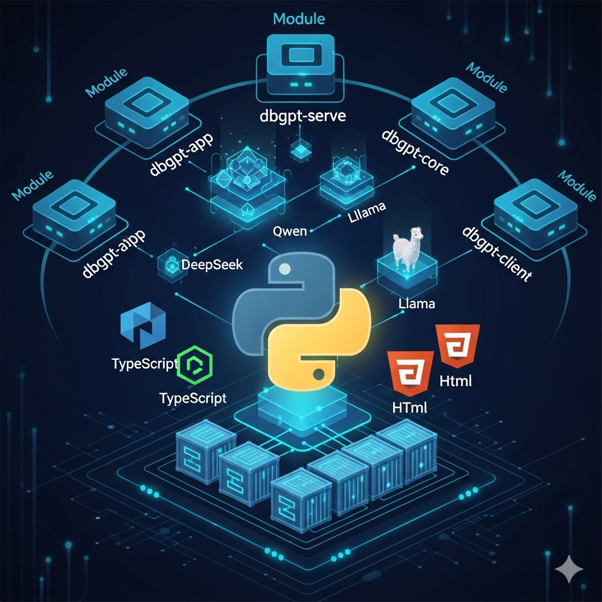
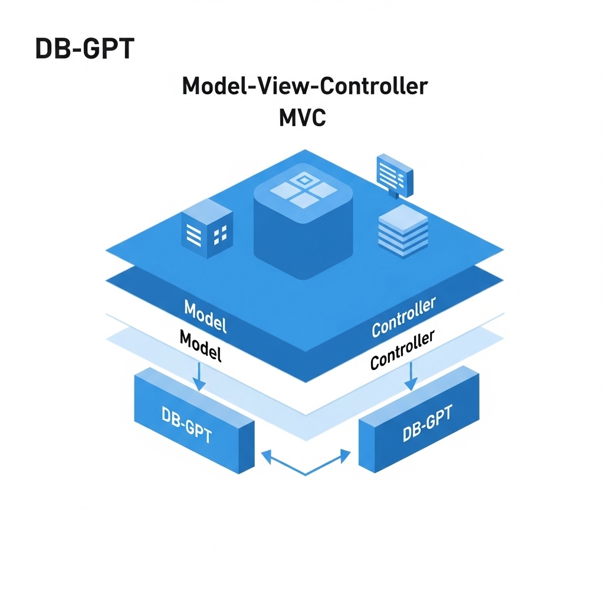
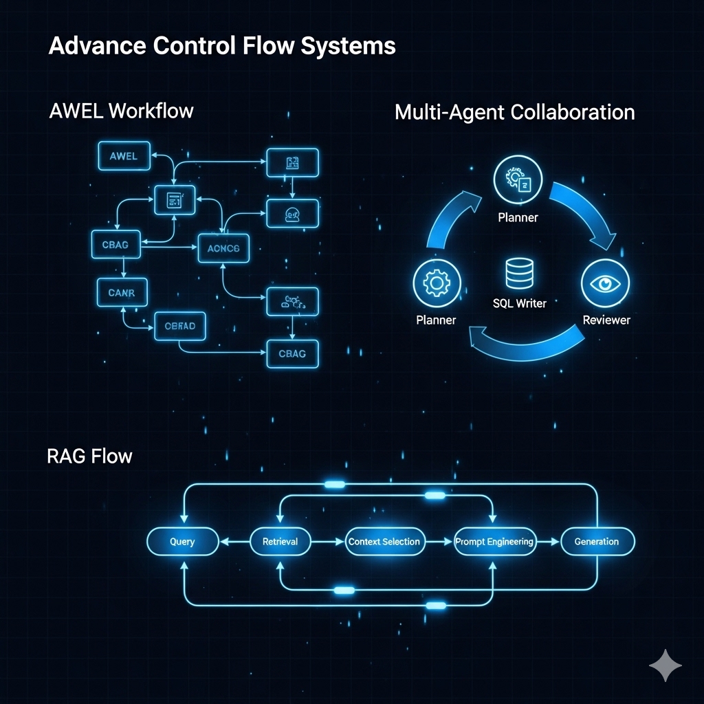

---

# DB-GPT Project Analysis

## 1. Project Overview

**DB-GPT** is an open-source, AI-native data application development framework. Its primary goal is to simplify the creation of large model applications that interact with databases. It leverages **AWEL (Agentic Workflow Expression Language)** and a robust **Multi-Agent** system to enable "Text-to-SQL" capabilities, Retrieval Augmented Generation (RAG), and generative business intelligence (GBI).

In the "Data 3.0" era, DB-GPT allows enterprises and developers to build bespoke applications with less code by integrating Large Language Models (LLMs) directly with production business data.

## 2. Tech Stack

The project relies on a modern, Python-centric AI stack with support for web interfaces and containerization.

* **Core Language:** Python (75.8%) - Used for the backend, agent logic, model serving, and orchestration.
* **Frontend/Interface:** TypeScript (13.6%), HTML (9.9%), CSS.
* **Orchestration & Deployment:** Docker, Shell scripts.
* **LLM Backends (SMMF):** Supports a wide range of models including DeepSeek (R1, V3), Qwen (2.5, 3), Llama 3/3.1, GLM, Yi, and others.
* **Protocols:** MCP Protocol (Model Context Protocol).
* **Key Modules:**
* `dbgpt-app`: Application layer.
* `dbgpt-serve`: Core service handling.
* `dbgpt-core`: Fundamental logic.
* `dbgpt-client`: Client-side interactions.

## 3. Architecture Pattern (MVC Analogy)

While DB-GPT is an AI-Agent framework rather than a traditional web app, its structure can be mapped to an **MVC (Model-View-Controller)** pattern for understanding:

### **Model (Data & Logic Layer)**

* **Data Sources:** The actual databases (MySQL, Hive, etc.) and structured/unstructured data files.
* **Knowledge Base:** Vector stores used for RAG.
* **SMMF (Service-oriented Multi-model Management Framework):** Manages the LLMs (the "brains" processing the data).
* **`dbgpt-core`:** Defines the fundamental data structures and operators.

### **View (Presentation Layer)**

* **`dbgpt-client` & `dbgpt-app`:** The user-facing components.
* **GPT-Vis:** A specialized visualization protocol/component for rendering data analytics, charts, and agent responses in a user-friendly format (e.g., rendering SQL results as bar charts).

### **Controller (Orchestration Layer)**

* **AWEL (Agentic Workflow Expression Language):** The central controller. It dictates how data flows from user input -> agents -> database -> LLM -> visualization.
* **Agents:** Autonomous workers that handle specific tasks (e.g., SQL generation, data cleaning) acting as sub-controllers for specific domains.

## 4. Control Flow Systems

DB-GPT moves beyond standard "if-then" logic, utilizing agentic and workflow-based control flows:

1. **AWEL (Agentic Workflow Expression Language):**
* This is the core orchestration engine. It treats workflows as **Directed Acyclic Graphs (DAGs)**.
* It allows developers to define "Flows" where nodes are operators (e.g., "Read Database", "Summarize Text", "Execute SQL").
* *Mechanism:* A trigger initiates a flow -> Data passes through various Operators -> Agents intervene if decision-making is required -> Final output is generated.

2. **Multi-Agent Collaboration:**
* The system uses a data-driven multi-agent framework.
* Agents are capable of self-evolution and decision-making based on data inputs.
* Control flows dynamically between agents (e.g., a "Planner Agent" might delegate a task to a "SQL Writer Agent" and then a "Reviewer Agent").

3. **RAG Flow:**
* Query -> Retrieval (Vector Search/Keyword Search) -> Reranking -> Augmentation (Prompt Engineering) -> Generation (LLM).

## 5. Architecture

The architecture is modular, designed to separate model management from application logic.

* **Layer 1: Data Sources:** Connectors for Databases, Excel, Warehouses, and Environment inputs.
* **Layer 2: Data Factory:** Handles cleaning, processing, and vectorization of data for "Trustworthy Knowledge."
* **Layer 3: Core Capabilities (The Engine):**
* **SMMF:** Abstraction layer to switch between models (Llama, DeepSeek, Qwen) without changing app logic.
* **RAG Framework:** Native retrieval augmentation.
* **Fine-tuning Framework:** Support for LoRA/QLoRA/P-tuning specifically optimized for Text-to-SQL (Spider dataset accuracy ~82.5%).

* **Layer 4: Application Layer:**
* **GBI (Generative Business Intelligence):** Automated reporting and analysis.
* **Chat Data:** Natural language interactions with Excel/DBs.

## 6. Advantages

* **Privacy First:** Built for "Private Domain" usage. It supports privatized large models and proxy desensitization, ensuring sensitive data doesn't leak to public APIs.
* **Model Agnostic:** The SMMF allows users to swap underlying LLMs easily (e.g., moving from Llama-3 to DeepSeek-V3) as new models are released.
* **Optimized for Data:** Specifically tuned for **Text-to-SQL**, claiming high accuracy (82.5% on Spider) via its fine-tuning framework.
* **Low-Code Workflows:** AWEL allows for visual or declarative orchestration of complex AI tasks, lowering the barrier to entry.
* **Rich Ecosystem:** Includes plugins, visualization tools (GPT-Vis), and support for various data formats (Excel, SQL, Hive).

## 7. Disadvantages & Challenges

* **Security Vulnerabilities:**
* Recent reports indicate issues with **Remote Code Execution (RCE)** (e.g., in `dbgpt-bm25-rag.toml` configuration and `/api/v1/agent/hub/update` endpoints).
* Issues regarding "bypassing code checks" suggest that sandbox isolation for agents needs improvement.

* **Stability Issues:**
* Open bugs regarding module synchronization, flow execution failures (e.g., "Input str of node required"), and streaming return errors.
* Some users report issues with basic setup (e.g., "Server can not up").

* **Complexity:**
* With submodules like `core`, `serve`, `app`, `hub`, and `vis`, the learning curve for deployment and debugging is steep.
* Dependency management across this distributed architecture can be difficult (e.g., Ollama connection errors).

* **Documentation Gaps:** Some issues (e.g., "Feature title" placeholders in bug reports) suggest that while development is fast, documentation and quality assurance processes may be playing catch-up.