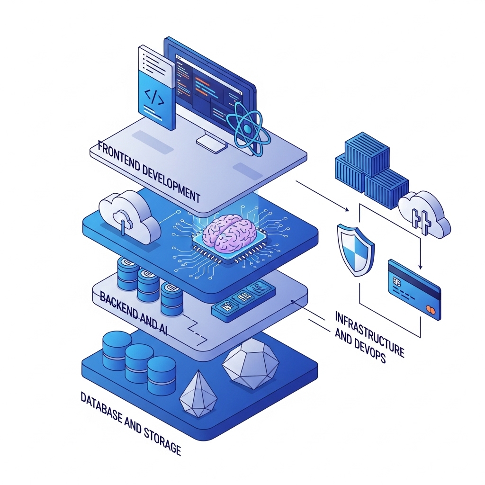
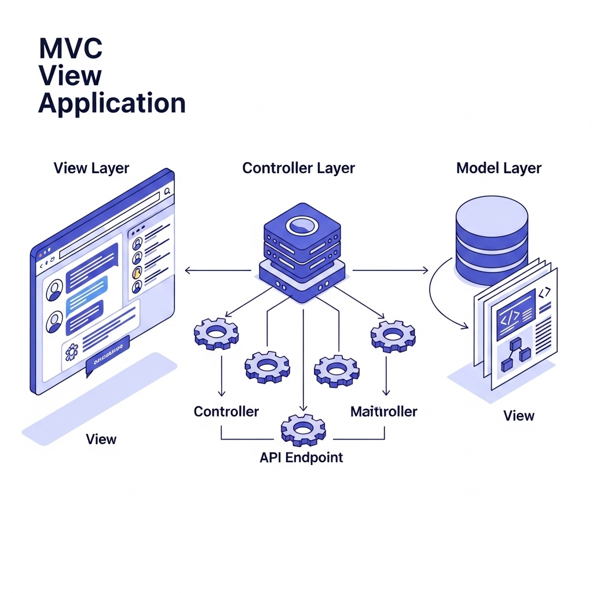
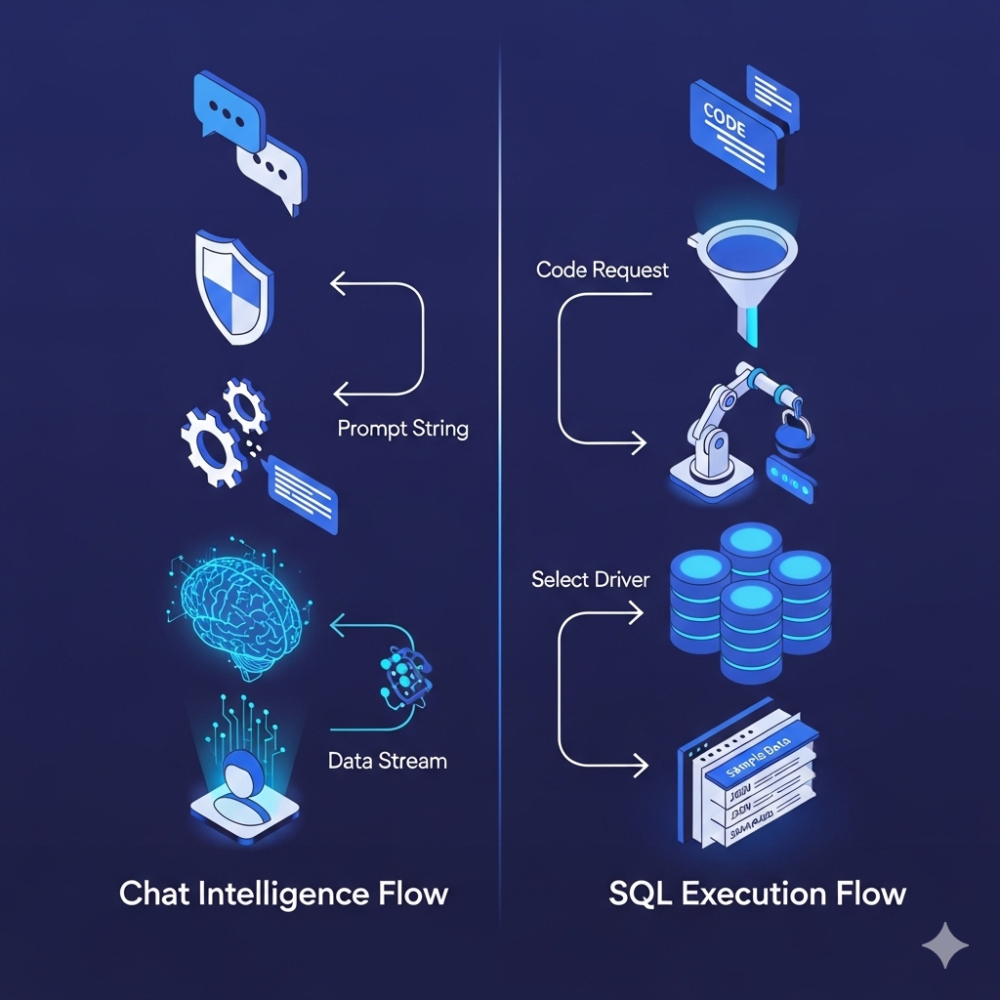
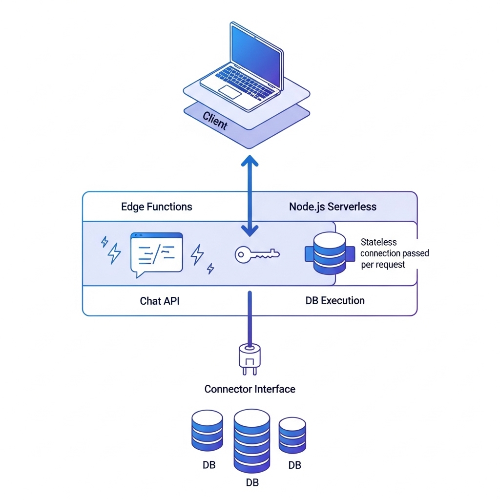

# SQL Chat - Technical Documentation

## 1. Project Overview
**SQL Chat** is a chat-based SQL client that allows users to interact with databases using natural language. It represents a shift towards "Developer Tools 2.0," replacing traditional, complex UI controls with an intuitive chat interface to query, modify, add, and delete data.

* **Deployment:** Available as a hosted service (`sqlchat.ai`) or self-hosted via Docker.
* **Supported Databases:** MySQL, PostgreSQL, MSSQL, TiDB Cloud, OceanBase.
* **Core Functionality:** Converts natural language prompts into SQL queries using OpenAI's GPT models and executes them against connected databases.

## 2. Tech Stack

The project utilizes a modern, full-stack TypeScript environment centered around the React ecosystem.

### Frontend
* **Framework:** [Next.js](https://nextjs.org/) (React framework).
* **Language:** TypeScript.
* **Styling:** Tailwind CSS, Emotion (`@emotion/react`), and Material UI (`@mui/material`).
* **State Management:** Zustand (`zustand`).
* **Icons:** React Icons, Heroicons.

### Backend & API
* **Runtime:** Node.js, with specific routes running on the Edge Runtime (e.g., chat streaming).
* **API Framework:** Next.js API Routes.
* **AI Integration:** OpenAI API (GPT-3.5/4) for natural language processing.
* **Streaming:** `eventsource-parser` for handling server-sent events (SSE) from OpenAI.

### Database & Storage (Application Data)
* **Primary Database:** PostgreSQL (stores users, chats, messages, usage quotas).
* **ORM:** Prisma (Schema definition, migrations, and client generation).
* **Redis/Cache:** Not explicitly mentioned in core dependencies, relies on Postgres for state.

### Infrastructure & DevOps
* **Authentication:** NextAuth.js (`next-auth`) for handling OAuth and session management.
* **Payments:** Stripe (`stripe`, `@stripe/stripe-js`) for subscription management.
* **Containerization:** Docker.

## 3. MVC (Model-View-Controller) Analysis

The application follows a variation of the MVC pattern typical of Next.js applications.

### **Model (Data Layer)**
Defines the structure of the application's data and business logic rules.
* **Prisma Schema (`prisma/schema.prisma`):** Defines entities like `User`, `Chat`, `Message`, `Usage`, `Account`, and `Payment`.
* **TypeScript Interfaces (`src/types/*.ts`):** Defines shapes for ephemeral data like database connections (`Connection`), execution results (`ExecutionResult`), and supported engines (`Engine`).

### **View (Presentation Layer)**
Handles the rendering of the user interface.
* **Pages (`src/pages/*`):** Next.js pages that map to routes (e.g., `index.tsx`, `setting/index.tsx`).
* **Components (`src/components/*`):** Reusable UI elements such as `ConversationView`, `ConnectionSidebar`, `CodeBlock`, and `DataTable`.

### **Controller (Logic Layer)**
Manages incoming requests, processes input, and coordinates between the Model and View.
* **API Routes (`src/pages/api/*`):**
    * `api/chat.ts`: Handles chat requests, quota checks, and streams responses from OpenAI.
    * `api/connection/execute.ts`: Receives SQL statements and connection details, executes them via the appropriate connector, and returns results.
    * `api/usage.ts`: Manages user quota tracking.

## 4. Control Flow Systems

### **Chat Intelligence Flow**
1.  **Input:** User sends a natural language message.
2.  **Authentication & Quota:** The system validates the user's session (`next-auth`) and checks usage limits in the `Usage` table via `api/usage`. If the user provides a custom OpenAI key, these checks are bypassed.
3.  **Prompt Engineering:** The backend constructs a prompt including the database schema (if connected) and the user's query.
4.  **AI Processing:** The request is sent to OpenAI's Chat Completion API (`v1/chat/completions`).
5.  **Streaming Response:** The response is streamed back to the client byte-by-byte using `ReadableStream` and `eventsource-parser` to provide a real-time typing effect.

### **SQL Execution Flow**
1.  **Request:** The frontend sends a POST request to `/api/connection/execute` containing the `connection` config (host, user, password) and the `statement` (SQL) to run.
2.  **Normalization:** If the engine is TiDB, it is normalized to use the MySQL driver.
3.  **Connector Factory:** The `newConnector` function selects the appropriate driver (MySQL, Postgres, MSSQL) based on the `engineType`.
4.  **Execution:** The driver establishes a transient connection to the target database, runs the query, and returns the data.
5.  **Response:** The result (or error) is returned as a JSON object to the frontend for rendering in a data table.

## 5. Architecture

The project is architected as a serverless-ready, full-stack web application.

* **Hybrid Runtime:**
    * **Edge Functions:** Used for the chat API (`api/chat.ts`) to minimize latency and handle long-lived streaming connections efficiently.
    * **Node.js Serverless Functions:** Used for database execution and standard CRUD operations.
* **Stateless Database Connections:** The backend does *not* persist connection secrets for target databases. Connection details are passed from the client with every execute request, enhancing security by not storing sensitive credentials on the server.
* **Database abstraction:** Uses a common `Connector` interface, allowing easy addition of new database engines without changing the core execution logic.

## 6. Advantages
* **Intuitive Interface:** Replaces complex SQL syntax with natural language, lowering the barrier for non-experts.
* **Privacy-Focused Options:**
    * "No Database" mode (`.env.nodb`) allows running the app without tracking user data.
    * Self-hosting via Docker ensures data never leaves the user's infrastructure.
* **BYO Key:** Users can supply their own OpenAI API Key to bypass server-side quotas.
* **Multi-DB Support:** Unified interface for MySQL, PostgreSQL, MSSQL, and others.

## 7. Disadvantages
* **Security/Network Complexity (Hosted):** The hosted version on Vercel uses dynamic IPs, requiring users to whitelist `0.0.0.0` on their database firewalls, effectively exposing the database to the entire internet.
* **Dependency on OpenAI:** The core value proposition fails if the OpenAI API is down or if the user lacks API credits/quota.
* **Credential Transport:** Because connection details are sent with execution requests, strict HTTPS is required to prevent credential interception.
* **Limited Context Window:** As a chat interface, handling massive schemas or extremely complex, multi-step transaction logic relies heavily on the AI's context window and reasoning capabilities.